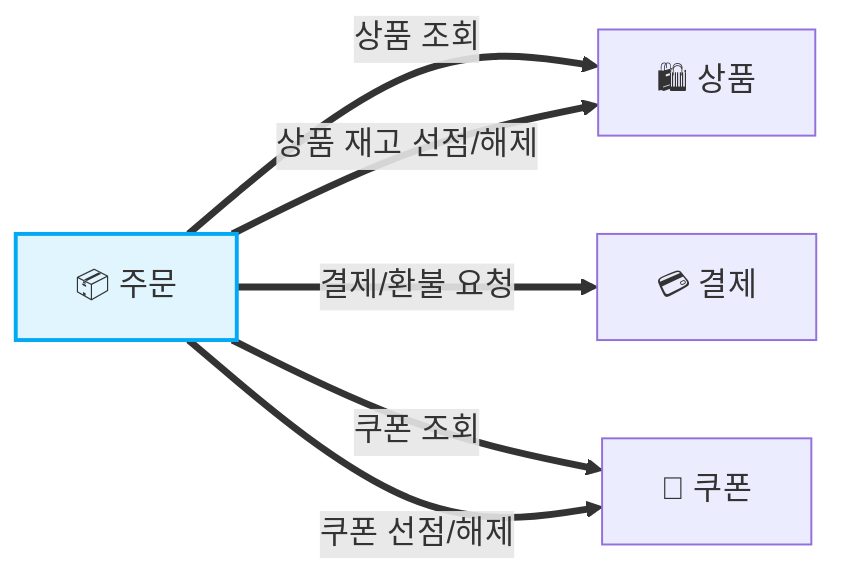
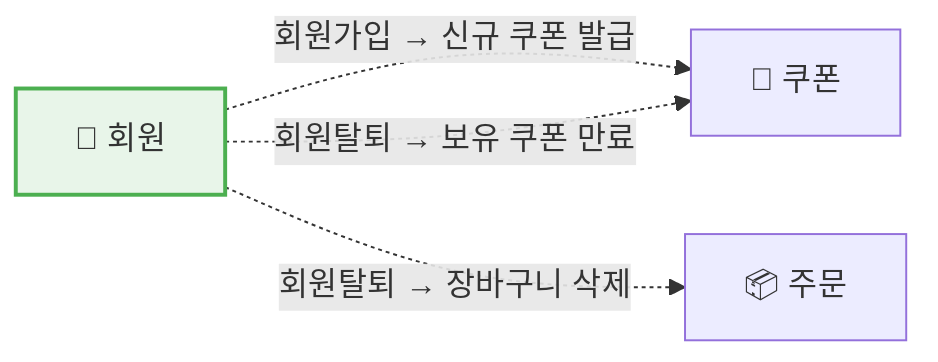
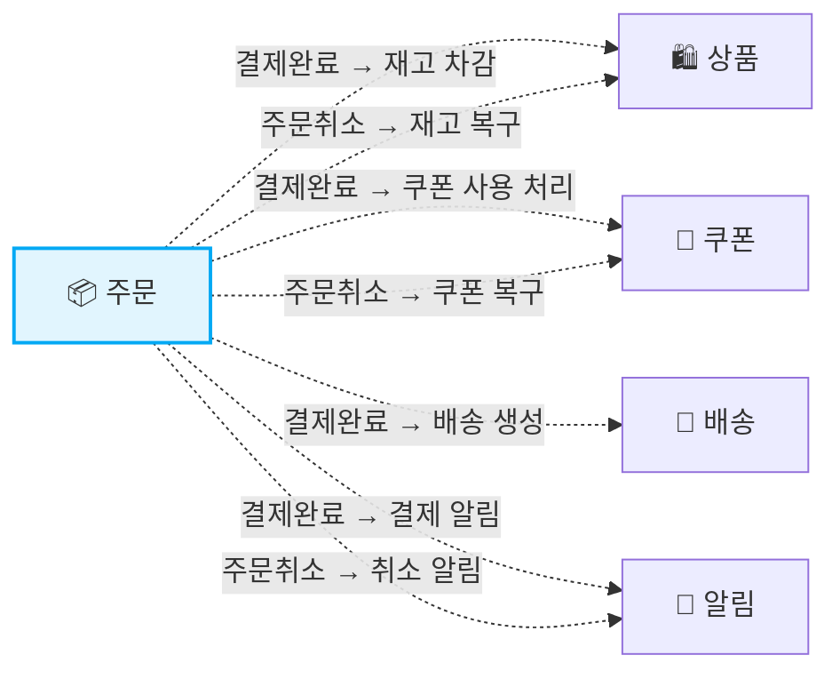
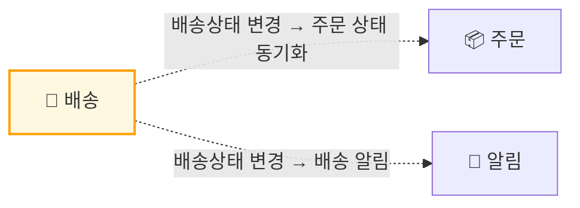

<div align="center">

# 🛒 DRF Commerce

**MSA 기반 이커머스 백엔드 플랫폼**


</div>

---

## 소개

DRF Commerce는 회원, 상품, 주문, 결제, 배송, 알림 등 핵심 도메인을 **독립적인 마이크로서비스**로 분리한 이커머스 백엔드 플랫폼입니다.

**핵심 기술 포인트**

- **Kafka 이벤트 기반 비동기 통신** — 서비스 간 직접 호출 없이 이벤트로 결합도를 낮춤
- **Redis Lua 스크립트를 활용한 원자적 재고 선점/해제** — 동시 요청 환경에서 네트워크 왕복 없이 단일 명령으로 재고 정합성 보장
- **JWT 기반 인증 + Role 기반 접근 제어** — Access(30분) / Refresh(7일) 이중 토큰 구조, `RoleCheckInterceptor`로 API 레벨 권한 제어
- **TSID를 활용한 분산 ID 생성** — Auto Increment 없이 분산 환경에서 충돌 없는 시간 정렬 가능한 고유 식별자 생성
- **Transactional Outbox Pattern** — 주문 상태 변경과 이벤트 적재를 동일 로컬 트랜잭션으로 묶어 커밋 후 릴레이 워커가 메시지 큐에 발행, DB와 메시지 브로커 간 데이터 정합성 보장
- **멱등성 보장 설계** — 이벤트 처리 시 `주문번호 + 이벤트 타입` Unique 제약으로 중복 컨슘 방지, API 요청 시 `Idempotency-Key` 헤더 기반 Unique INSERT로 클라이언트
  재시도 안전 처리
- **Saga 패턴 (보상 트랜잭션)** — 결제 실패 시 쿠폰·재고 선점을 순차적으로 API 호출해 롤백, 분산 환경에서 데이터 정합성 유지
- **Access Token Blacklist (Redis)** — 로그아웃·회원 탈퇴 시 만료 전 Access Token을 Redis에 등록해 즉시 무효화, Refresh Token도 Redis에서 삭제 처리

---

## 도메인 통신 구조

### 동기 통신 (REST API)



### 비동기 통신 (Kafka Event)

**회원 이벤트**



**주문 이벤트**



**배송 이벤트**



---

## 기술 스택

| Category              | Stack                                    |
|-----------------------|------------------------------------------|
| Language              | Java 21                                  |
| Framework             | Spring Boot 3.5                          |
| Database              | MySQL 8                                  |
| 인증 토큰 / Cache / 재고 관리 | Redis, Lua Script                        |
| Message Broker        | Apache Kafka                             |
| 인증                    | JWT (JJWT 0.13) · Spring Security Crypto |
| ID 생성                 | TSID Creator                             |
| Build                 | Gradle (Multi-module)                    |

---

## 유스케이스

### 회원 서비스

| 유스케이스         | 👤 회원 | 🔧 관리자 |
|---------------|:-----:|:------:|
| 회원 가입 / 탈퇴    |   ✅   |        |
| 로그인 / 로그아웃    |   ✅   |   ✅    |
| 회원 정보 조회 / 수정 |   ✅   |        |
| 비밀번호 변경       |   ✅   |        |
| 배송지 관리        |   ✅   |        |

### 상품 서비스

| 유스케이스             | 👤 회원 | 🔧 관리자 | ⚙️ 시스템 |
|-------------------|:-----:|:------:|:------:|
| 상품 검색             |   ✅   |        |        |
| 상품 목록 조회          |   ✅   |        |        |
| 상품 상세 조회          |   ✅   |        |        |
| 상품 등록 / 수정 / 삭제   |       |   ✅    |        |
| 카테고리 등록 / 수정 / 삭제 |       |   ✅    |        |
| 재고 관리             |       |   ✅    |   ✅    |

### 주문 서비스

| 유스케이스                | 👤 회원 | ⚙️ 시스템 |
|----------------------|:-----:|:------:|
| 장바구니 상품 추가 / 수정 / 삭제 |   ✅   |        |
| 장바구니 목록 조회           |   ✅   |        |
| 주문 / 취소              |   ✅   |        |
| 주문 내역 조회             |   ✅   |        |
| 주문 상태 관리             |       |   ✅    |

### 쿠폰 서비스

| 유스케이스           | 👤 회원 | 🔧 관리자 | ⚙️ 시스템 |
|-----------------|:-----:|:------:|:------:|
| 쿠폰 조회           |   ✅   |        |        |
| 쿠폰 사용           |   ✅   |        |        |
| 쿠폰 발급           |   ✅   |        |   ✅    |
| 쿠폰 등록 / 수정 / 삭제 |       |   ✅    |        |
| 쿠폰 만료 처리        |       |        |   ✅    |

### 결제 서비스

| 유스케이스    | 👤 회원 | 🏦 PG사 |
|----------|:-----:|:------:|
| 결제 / 환불  |   ✅   |   ✅    |
| 결제 내역 조회 |   ✅   |        |
| 결제 수단 관리 |   ✅   |        |

### 배송 서비스

| 유스케이스    | 👤 회원 | ⚙️ 시스템 | 📦 택배사 |
|----------|:-----:|:------:|:------:|
| 배송 생성    |       |   ✅    |        |
| 배송 상태 관리 |       |   ✅    |   ✅    |
| 배송 조회    |   ✅   |        |        |

### 알림 서비스

| 유스케이스    | 👤 회원 | ⚙️ 시스템 |
|----------|:-----:|:------:|
| 알림 발송    |       |   ✅    |
| 푸시 내역 조회 |   ✅   |        |

---

## ERD

> 전체 도메인 ERD는 아래 링크에서 확인할 수 있습니다.

[📐 ERD 보기 (dbdiagram.io)](https://dbdiagram.io/d/drf_commerce_v2-69ae14aaa44dc25f8b465f07)

---

## 모듈 구조

```
drf-commerce/
├── common-module/        # 공유 라이브러리 (예외, 응답, Kafka, 인터셉터)
├── member-server/        # 회원 · 인증 서비스
├── product-server/       # 상품 · 재고 서비스
├── order-server/         # 주문 · 장바구니 서비스
├── coupon-server/        # 쿠폰 발급 · 선점 · 만료 서비스
├── payment-server/       # 결제 · 환불 서비스
├── delivery-server/      # 배송 생성 · 상태 관리 서비스
├── notification-server/  # 알림 발송 · 내역 서비스
├── build.gradle
└── settings.gradle
```