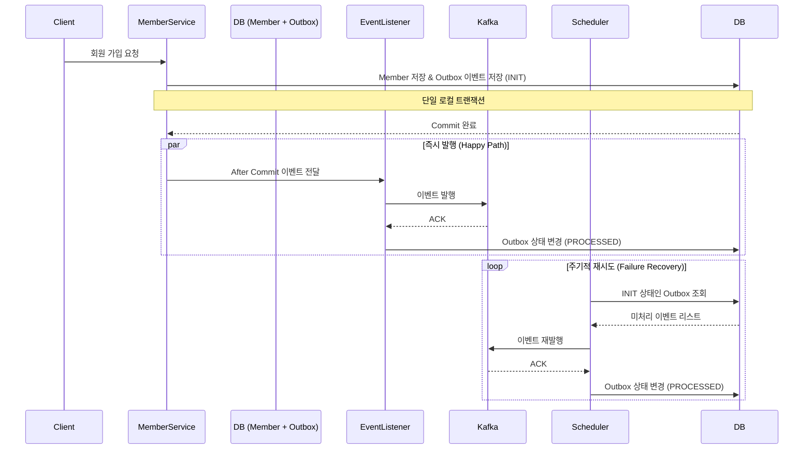

# 회원 서비스 설계 문서 (Member Service)

## 1. 개요

회원 서비스는 사용자 인증(Authentication), 인가(Authorization), 회원 정보 관리 및 탈퇴 정책을 담당합니다. MSA 환경에서 타 서비스(쿠폰, 주문 등)와의 연계 및 데이터 정합성을 위해
이벤트 기반 아키텍처를 채택하고 있습니다.

## 2. 핵심 도메인 모델

### 2-1. 회원 (Member)

- **Email**: 고유 식별자. 로그인 ID로 사용.
- **Password**: Spring Security Crypto를 이용한 암호화 저장.
- **Status**: ACTIVE(활성), WITHDRAWN(탈퇴).
- **개인정보**: 이름, 전화번호, 생년월일.

### 2-2. 탈퇴 이력 (WithdrawnMemberHistory)

- 탈퇴 시 회원의 이메일과 탈퇴 시점을 기록하여, 일정 기간(예: 30일) 내 동일 이메일로의 재가입을 제한하는 정책을 수행합니다.

## 3. 인증 및 보안 전략

### 3-1. JWT 기반 인증

- **Access Token**: 짧은 만효 기간(예: 30분)을 가지며 Stateless하게 사용됩니다.
- **Refresh Token**: Redis에 저장하여 보안성을 강화하고, 토큰 탈취 시 해당 세션을 강제로 무효화할 수 있습니다.

### 3-2. 로그아웃 및 블랙리스트 전략 (Distributed Security)

- **API Gateway 검증**: 모든 인입 요청에 대해 API Gateway가 JWT를 파싱하고, 공유 **Redis**를 조회하여 블랙리스트 여부를 확인합니다.
- **Member Server 역할**: 로그아웃 요청 시 해당 Access Token의 잔여 유효 기간만큼 Redis에 블랙리스트 정보를 등록하여 관리합니다.
- **이점**: 무효화된 토큰을 시스템 최외곽에서 차단함으로써 하위 마이크로서비스의 자원 낭비를 방지하고 보안 일관성을 유지합니다.

### 3-3. 토큰 갱신 (Token Refresh) 및 RTR 전략

- **Refresh Token Rotation (RTR)**: 보안 강화를 위해 토큰 갱신 요청 시 새로운 Access Token과 함께 **Refresh Token도 매번 재발급**하여 토큰 탈취 위험을
  최소화합니다.
- **갱신 프로세스**:
    1. 클라이언트가 저장된 **Refresh Token**으로 갱신 요청을 보냅니다.
    2. 서버는 토큰의 서명 및 만료 여부를 검증하고, **Redis**에 저장된 토큰과 일치하는지 대조합니다.
    3. 검증 성공 시 기존 Refresh Token을 무효화하고, 새로운 **Access/Refresh Token 쌍**을 발급하여 Redis를 업데이트합니다.
    4. 이를 통해 한 번 사용된 Refresh Token은 다시 사용할 수 없도록 강제합니다.

## 4. 데이터 정합성 보장 (Transactional Outbox 패턴)

분산 환경에서 회원 가입 성공 시 쿠폰 발행 등의 부가 로직이 반드시 수행되어야 하므로, DB 트랜잭션과 이벤트 발행 간의 원자성을 보장하기 위해 Outbox 패턴을 적용합니다.

### 4-1. 시퀀스 다이어그램

## 5. 개인정보 처리 및 익명화

- 탈퇴 시 `Member` 엔티티의 개인정보(이름, 이메일, 전화번호)를 UUID 기반의 가상 데이터로 치환(Anonymization)합니다.
- 이는 주문/리뷰 등 타 서비스에서 해당 회원을 참조하고 있는 데이터의 무결성을 깨뜨리지 않으면서, 개인정보 보호법을 준수하기 위함입니다.

## 6. Redis 키 설계 (Key Naming Convention)

분산 환경에서의 데이터 관리와 조회 성능을 최적화하기 위해 다음과 같은 Redis 키 설계 규칙을 따릅니다.

### 6-1. Refresh Token 저장소

- **Key Pattern**: `auth:refresh_token:{role}:{memberId}`
- **Value**: Refresh Token 문자열
- **TTL**: Refresh Token 유효 기간 (예: 7일)
- **용도**: 토큰 갱신(RTR) 요청 시 서버에 저장된 정당한 토큰인지 검증하기 위해 사용됩니다.

### 6-2. Access Token 블랙리스트

- **Key Pattern**: `auth:blacklist:{accessToken}`
- **Value**: `"logout"`
- **TTL**: 해당 Access Token의 잔여 유효 기간
- **용도**: 로그아웃된 토큰을 API Gateway에서 즉시 식별하여 차단하기 위해 사용됩니다. 토큰이 만료되면 Redis에서도 자동 삭제되어 메모리 효율을 높입니다.
